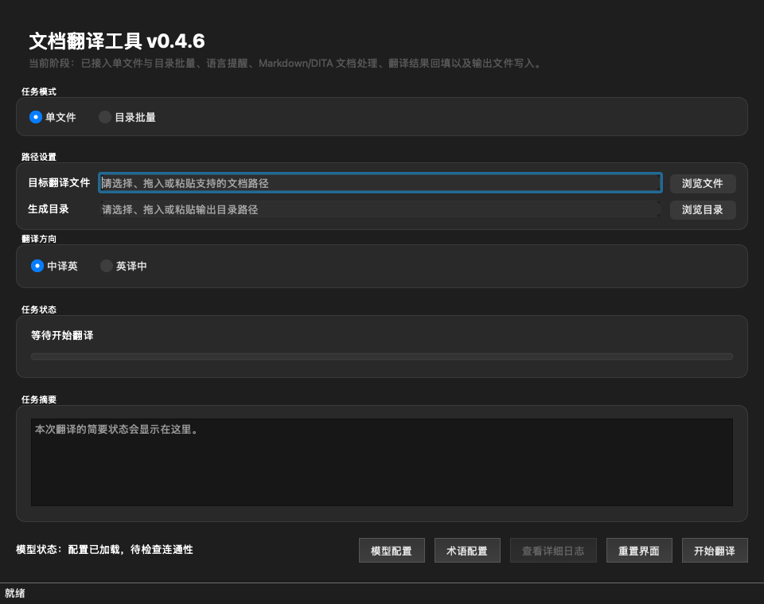
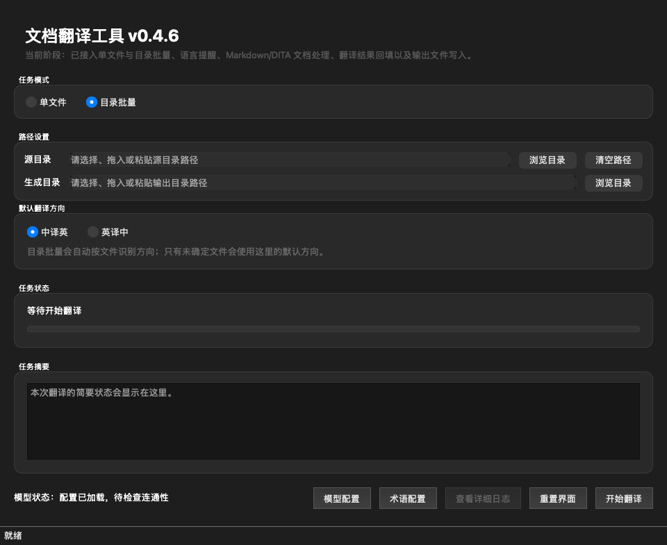
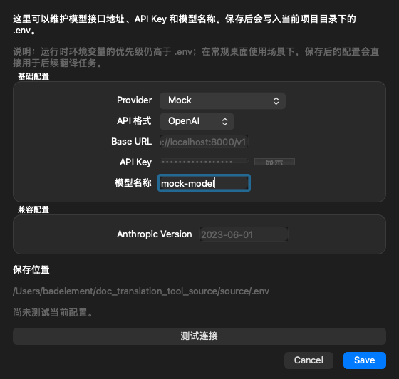
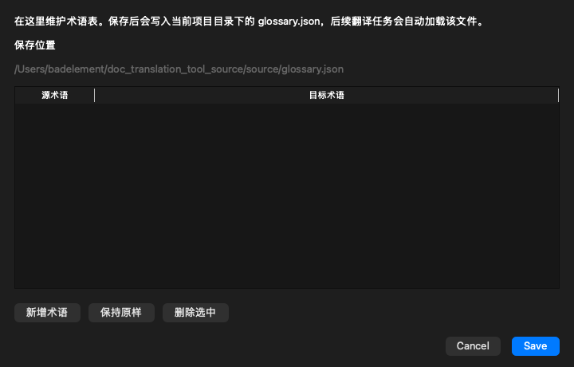

# Document Translation Tool

<div align="center">


**Desktop tool for translating Markdown and DITA documents between Chinese and English while preserving document structure.**

[English](./README.md) | [中文文档](./source/使用指南.md)

</div>

## ✨ Features

- 📄 **Multiple Formats** - Support for Markdown (`.md`) and DITA (`.dita`) documents
- 🔄 **Bidirectional Translation** - Chinese ↔ English with auto-detection
- 🎯 **Structure Preservation** - Maintains formatting, tables, code blocks, and front matter
- 🚀 **Batch Processing** - Translate entire directories with parallel processing
- 🤖 **Multiple LLM Providers** - OpenAI-compatible and Anthropic-compatible APIs
- 📚 **Custom Glossary** - Define terminology for consistent translations
- 💾 **Resume Support** - Continue interrupted translations from checkpoints
- 🎨 **User-Friendly GUI** - Clean interface with real-time progress tracking

## 📸 Screenshots

<details>
<summary>Click to view screenshots</summary>

### Single File Mode


### Batch Translation Mode


### Model Configuration


### Glossary Management


</details>

## 🚀 Quick Start

### Download Pre-built Packages

**Windows**
1. Download `DocTranslationTool-win64.zip` from [Releases](../../releases)
2. Extract to a folder
3. Edit `.env` with your API credentials
4. Run `DocTranslationTool.exe`

**macOS**
1. Download `DocTranslationTool-macos.zip` from [Releases](../../releases)
2. Extract to a folder
3. Edit `.env` with your API credentials
4. Right-click `DocTranslationTool.app` → Open (first time only)

### Run from Source

```bash
# Clone the repository
git clone https://github.com/Badelement/doc_translation_tool.git
cd doc_translation_tool/source

# Install dependencies
python3 -m pip install -e .

# Configure API credentials
cp .env.example .env
# Edit .env with your API key and endpoint

# Run the application
python3 app.py
```

## 📖 Usage

1. **Configure API Settings**
   - Click "模型配置" to set your LLM provider, API key, and model
   - Supported providers: OpenAI, Anthropic, Azure OpenAI, or any OpenAI-compatible endpoint

2. **Choose Translation Mode**
   - **Single File**: Translate one document at a time
   - **Directory Batch**: Process multiple files in a folder

3. **Select Files**
   - Choose source file/directory and output location
   - Translation direction is auto-detected (or manually set)

4. **Start Translation**
   - Monitor real-time progress with batch-level updates
   - View detailed logs in the log panel

## 🎯 Use Cases

- **Technical Documentation** - Translate API docs, user guides, and technical specifications
- **Content Localization** - Prepare multilingual content for global audiences
- **Knowledge Base** - Maintain synchronized documentation in multiple languages
- **Academic Papers** - Translate research documents while preserving formatting

## 🛠️ Advanced Features

### Custom Glossary
Define terminology for consistent translations across documents:
```json
[
  { "source": "API", "target": "API" },
  { "source": "用户界面", "target": "User Interface" }
]
```

### Batch Processing
- Configurable parallel processing for faster translations
- Automatic rate limiting and retry logic
- Resume from checkpoints after interruptions

### Structure Preservation
- Markdown: Front matter, code blocks, tables, links, images
- DITA: XML structure, attributes, code elements
- Protected elements: HTML tags, file paths, technical constants

## 📚 Documentation

- [User Guide (Chinese)](./source/使用指南.md) - Detailed usage instructions
- [Configuration Guide](./source/docs/CONFIGURATION.md) - Advanced settings
- [Packaging Guide](./source/PACKAGING.md) - Build instructions
- [Changelog](./source/CHANGELOG.md) - Version history

## 🤝 Contributing

Contributions are welcome! Please feel free to submit issues and pull requests.

## 📄 License

This project is licensed under the MIT License - see the [LICENSE](./LICENSE) file for details.

## 🙏 Acknowledgments

Built with:
- [PySide6](https://www.qt.io/qt-for-python) - GUI framework
- [httpx](https://www.python-httpx.org/) - HTTP client
- [python-dotenv](https://github.com/theskumar/python-dotenv) - Configuration management

---

<div align="center">
Made with ❤️ for the translation community
</div>
